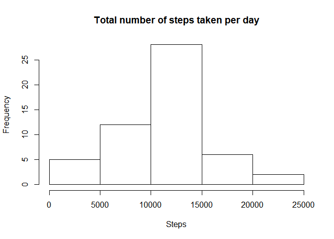
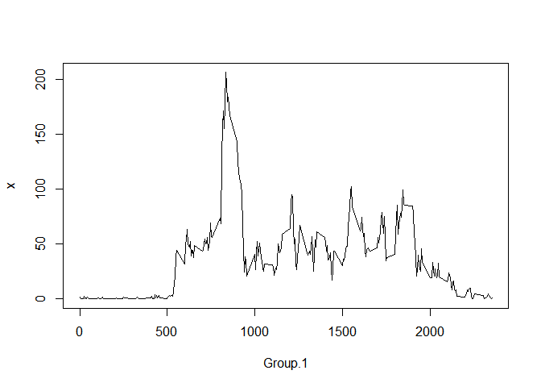
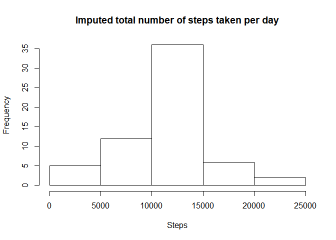
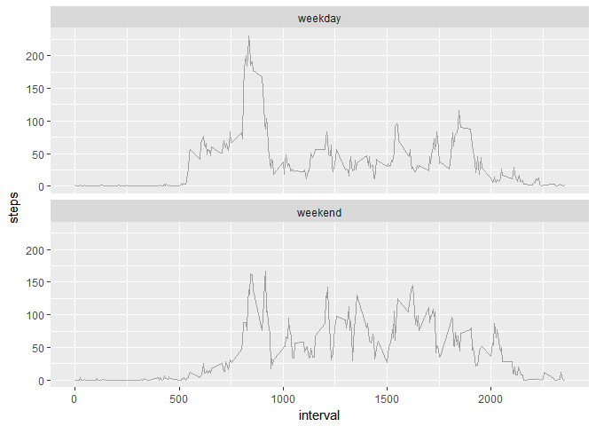

# Reproducible Research: Peer Assessment 1


## Loading and preprocessing the data

```r
#get the current folder
        curdir <- getwd()       
#Download file if not present in current directory
if (!file.exists("activity.zip")) {
        #assign the location of the file
        fileUrl <-
                "https://d396qusza40orc.cloudfront.net/repdata%2Fdata%2Factivity.zip"
        # download the file
        download.file(fileUrl, destfile = "activity.zip", method = "libcurl")

}
#UNzip the file
        unzip ("activity.zip", exdir = ".")
#get the file name with path
        data_file <-
                paste0(curdir, "/", unzip(paste0(curdir, "/", "activity.zip"), list = TRUE)[1])

act_df <- read.csv(data_file) 
```


## What is mean total number of steps taken per day?

Total number of steps taken per day


```r
hist(aggregate(act_df$steps,list(act_df$date),sum)$x, main="Total number of steps taken per day", xlab="Steps")
```

<!-- -->

Mean of total number of steps taken per day


```r
mean(aggregate(act_df$steps,list(act_df$date),sum)$x,na.rm=TRUE)
```

```
## [1] 10766.19
```

Median of total number of steps taken per day


```r
median(aggregate(act_df$steps,list(act_df$date),sum)$x,na.rm=TRUE)
```

```
## [1] 10765
```

## What is the average daily activity pattern?

A time series plot of the 5-minute interval (x-axis) and the average number of steps taken, averaged across all days (y-axis)
 

```r
dailypat<-aggregate(act_df$steps,list(act_df$interval),mean, na.rm=TRUE, na.action=NULL)
plot(dailypat, type="l")
```

<!-- -->

Which 5-minute interval, on average across all the days in the dataset, contains the maximum number of steps?


```r
mval=max(aggregate(act_df$steps,list(act_df$interval),mean, na.rm=TRUE, na.action=NULL)$x)
dailypat[dailypat$x==mval,]
```

```
##     Group.1        x
## 104     835 206.1698
```

## Imputing missing values

Total number of missing values in the dataset


```r
sum(is.na(act_df$steps))
```

```
## [1] 2304
```
Our strategy to fill in the NAs will be defined via a function that will use the  mean for that 5-minute interval as follows:

```r
imputed<-act_df
# Function for the data imputing

mean.imp<-function(a){
        if(is.na(a[1])){
                a[1]<-dailypat[dailypat$Group.1==as.numeric(as.character(a[3])),2]
                return(as.numeric(as.character(a[1])))
        }
        else
                return(as.numeric(as.character(a[1])))
}

imputed$steps<-apply(imputed,1,mean.imp)

hist(aggregate(imputed$steps, list(imputed$date), sum)$x,
     main = "Imputed total number of steps taken per day",
     xlab = "Steps")
```

<!-- -->

Mean of total number of steps taken per day


```r
mean(aggregate(imputed$steps,list(imputed$date),sum)$x,na.rm=TRUE)
```

```
## [1] 10766.19
```

Median of total number of steps taken per day


```r
median(aggregate(imputed$steps,list(imputed$date),sum)$x,na.rm=TRUE)
```

```
## [1] 10766.19
```


## Are there differences in activity patterns between weekdays and weekends?


```r
imputed$date<-strptime(imputed$date, "%Y-%m-%d")
imputed$day <-
        sapply(weekdays(imputed$date), function(x)
        if (x %in% c("Sunday", "Saturday"))
        "weekend"
        else
        "weekday", simplify = TRUE, USE.NAMES = F)
        
imputed$day <- as.factor(imputed$day)

library(ggplot2)
f <-
        ggplot(imputed, aes(interval, steps)) + stat_summary(
                fun.y = mean,
                geom = "line",
                size = 0.5,
                alpha = 1 / 3
        ) + facet_wrap( ~ day, nrow = 2)
f
```

<!-- -->


